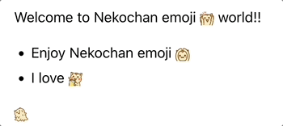
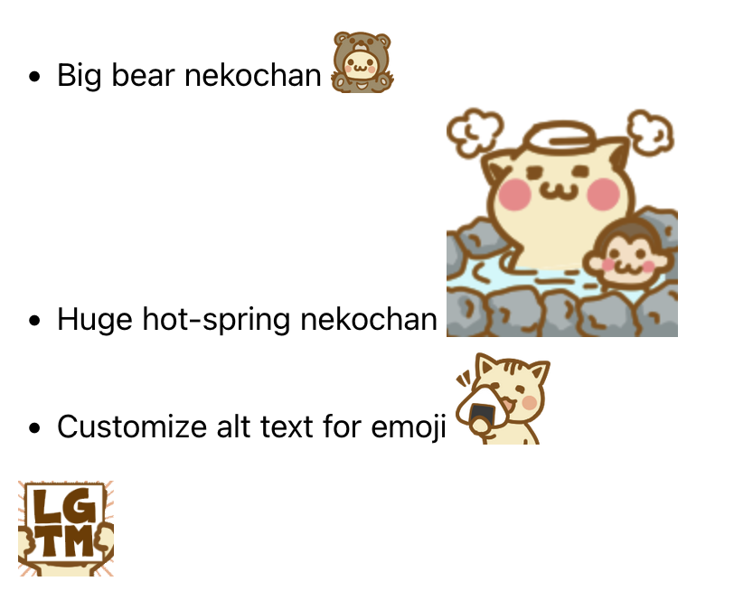

# sphinx-nekochan

A Sphinx extension for adding the **Nekochan(cat) emoji** to documents.

See [the sphinx-nekochan documantation](https://sphinx-nekochan.readthedocs.io/) for more details.

## Installation

You can install `sphinx-nekochan` with `pip`:

```
pip install sphinx-nekochan
```

## Enable extension

In your `conf.py` configuration file, add `sphinx_nekochan` to your extensions list:

```python
extensions = [
    ...
    "sphinx_nekochan",
    ...
]
```

## Use `nekochan` role

When you use the `nekochan` roll, you will see any nekochan emoji.

* markdown

```markdown
Welcome to nekochan emoji {nekochan}`banzai` world!!

* Enjoy nekochan emoji {nekochan}`choo-choo-train`
* I love {nekochan}`beer`
```

* reStructuredText

```rst
Welcome to nekochan emoji :nekochan:`banzai` world!!

* Enjoy nekochan emoji :nekochan:`choo-choo-train`
* I love :nekochan:`beer`
```



## Customize emoji height and alt text 

You can specify height and alt text with a semicolon(`;`) after the name of the `nekochan` role.

* markdown

```markdown
* Big bear nekochan {nekochan}`kuma-nya;2em`
* Huge hot-sprint nekochan {nekochan}`hot-spring;128px`
* Customize alt text for emoji {nekochan}`gohan-taberu;3em;Nekochan eating rice ball`
```

* reStructuredText

```rst
* Big bear nekochan :nekochan:`kuma-nya;2em`
* Huge hot-sprint nekochan :nekochan:`hot-spring;128px`
* Customize alt text for emoji :nekochan:`gohan-taberu;3em;Nekochan eating rice ball`
```


